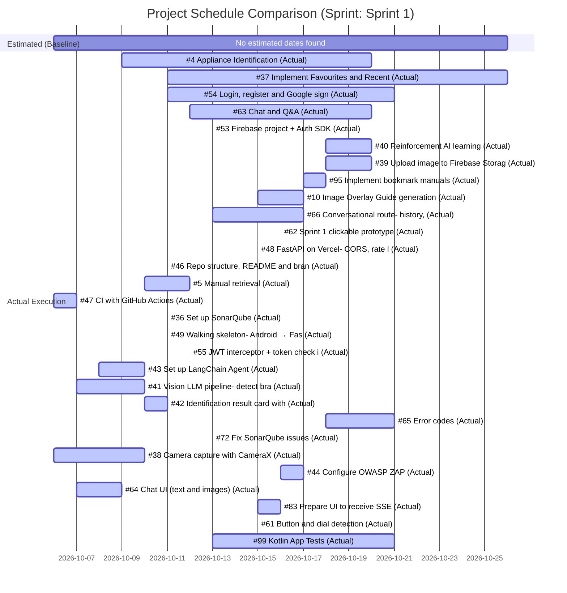

# Project Gantt Comparison (Sprint: Sprint 1)

```mermaid
gantt
    title Project Schedule Comparison (Sprint: Sprint 1)
    dateFormat  YYYY-MM-DD

    section Estimated (Baseline)
    No estimated dates found : 2026-10-06, 2026-10-26

    section Actual Execution
    #4 Appliance Identification (Actual) :active, a_4, 2026-10-09, 2026-10-20
    #37 Implement Favourites and Recent (Actual) :active, a_37, 2026-10-11, 2026-10-26
    #54 Login, register and Google sign (Actual) :active, a_54, 2026-10-11, 2026-10-21
    #63 Chat and Q&A (Actual) :active, a_63, 2026-10-12, 2026-10-20
    #53 Firebase project + Auth SDK (Actual) :active, a_53, 2026-10-13, 2026-10-13
    #40 Reinforcement AI learning (Actual) :active, a_40, 2026-10-18, 2026-10-20
    #39 Upload image to Firebase Storag (Actual) :active, a_39, 2026-10-18, 2026-10-20
    #95 Implement bookmark manuals (Actual) :active, a_95, 2026-10-17, 2026-10-18
    #10 Image Overlay Guide generation (Actual) :active, a_10, 2026-10-15, 2026-10-17
    #66 Conversational route- history,  (Actual) :active, a_66, 2026-10-13, 2026-10-17
    #62 Sprint 1 clickable prototype (Actual) :active, a_62, 2026-10-16, 2026-10-16
    #48 FastAPI on Vercel- CORS, rate l (Actual) :active, a_48, 2026-10-15, 2026-10-15
    #46 Repo structure, README and bran (Actual) :active, a_46, 2026-10-11, 2026-10-11
    #5 Manual retrieval (Actual) :active, a_5, 2026-10-10, 2026-10-12
    #47 CI with GitHub Actions (Actual) :active, a_47, 2026-10-06, 2026-10-07
    #36 Set up SonarQube (Actual) :active, a_36, 2026-10-11, 2026-10-11
    #49 Walking skeleton- Android → Fas (Actual) :active, a_49, 2026-10-11, 2026-10-11
    #55 JWT interceptor + token check i (Actual) :active, a_55, 2026-10-12, 2026-10-12
    #43 Set up LangChain Agent (Actual) :active, a_43, 2026-10-08, 2026-10-10
    #41 Vision LLM pipeline- detect bra (Actual) :active, a_41, 2026-10-07, 2026-10-10
    #42 Identification result card with (Actual) :active, a_42, 2026-10-10, 2026-10-11
    #65 Error codes (Actual) :active, a_65, 2026-10-18, 2026-10-21
    #72 Fix SonarQube issues (Actual) :active, a_72, 2026-10-13, 2026-10-13
    #38 Camera capture with CameraX (Actual) :active, a_38, 2026-10-06, 2026-10-10
    #44 Configure OWASP ZAP (Actual) :active, a_44, 2026-10-16, 2026-10-17
    #64 Chat UI (text and images) (Actual) :active, a_64, 2026-10-07, 2026-10-09
    #83 Prepare UI to receive SSE (Actual) :active, a_83, 2026-10-15, 2026-10-16
    #61 Button and dial detection (Actual) :active, a_61, 2026-10-15, 2026-10-15
    #99 Kotlin App Tests (Actual) :active, a_99, 2026-10-13, 2026-10-21

```